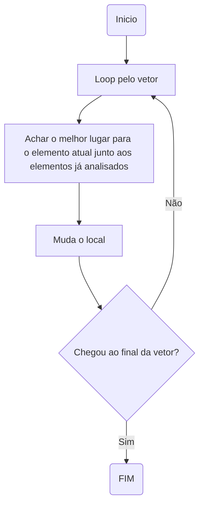
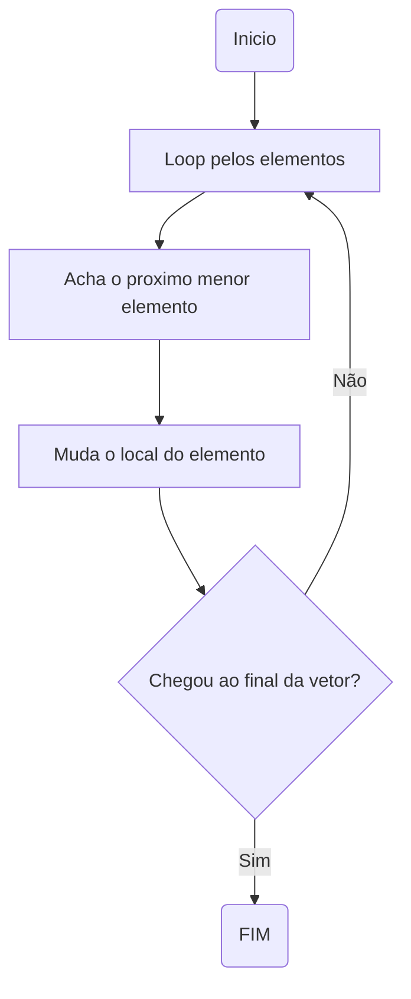
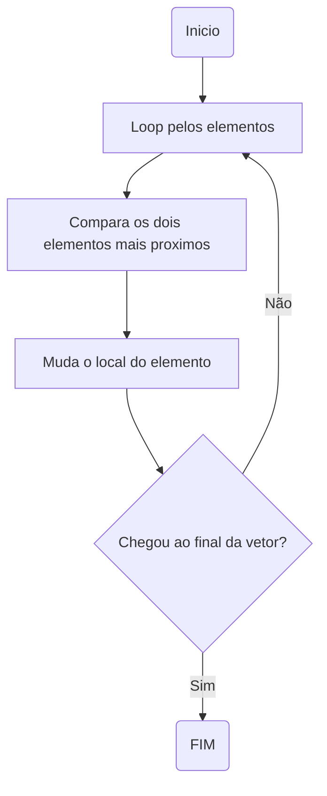

# Projeto-Integrado

Cadeira de Projeto Integrado

## Contextualização

Neste trabalho iremos identificar diferentes algoritmos de sequenciamento e vamos comparar a performance deles com uma amostra gerada de numeros aleatorios.

O trabalho será desenvolvido utilizando a metodologia Scrum. O relatorio da sprint pode ser encontrado no arquivo `sprint.md`

O codigo fonte deste projeto deve estar disponivel junto a documentação.
Todo o binario disponibilizado junto ao codigo fonte é copilado para funcionar em um sistema compativel com POSIX de 64 bits.

## Funcionamento

### Amostra

A amostra foi criada utilizando um algoritmo que gera variaveis aleatorias em C.

Este é o arquivo `amostra.c`, ele cria um arquivo chamado `dados` com numeros inteiros aleatorios.
Você pode alterar o numero de inteiros modificando a definição de `MAX`.

```
Cuidado!
O numero maximo que pode ser utilizado em `MAX` é 2147483646.
```

### Comparação

A Comparação é feita executando todos os algoritmos a serem testados em ordem e gravando o tempo de execução usando um timer do sistema.
Ao rodar o algoritmo o mesmo irá calcular o tempo necessario para concluir a ordenação de sua amostra e salvar no arquivo `resultados.txt`.
O resultado pode ser avaliado pelo programa `checagem.c` ou por um leitor de arquivos de texto.

O arquivo restultados vai conter o numero de clocks utilizado pelo processador para processar o arquivo dividido pelo numero de clocks por segundo em formato float junto ao nome do algoritmo utilizado.

### Algoritmos comparados

Serão comparados os seguintes algoritmos:

> Implementação obrigatoria:
> 
> 1. Insertion sort
> 2. Selection sort
> 3. Bubble sort
> 
> Implementação opcional:
> 
> 1. Merge sort
> 2. Heapsort
> 3. Shell sort
> 4. Radix sort
> 5. Gnome sort
> 6. Counting sort
> 7. Bucket sort
> 8. Cocktail sort
> 9. Timsort
> 10. Quick sort

As implementações obrigatorias deveram estar disponiveis até o final da sprint, as opcionais deveram ser adicionadas caso as implementações obrigatorias estejam já completas e sobre tempo na sprint.

#### Insert sort

Logica Insert sort:



#### Selection sort

Logica Selection sort:



#### Bubble sort

Logica Bubble sort:



## Implementação

A implementação será toda feita em linguagem C utilizando apenas bibliotecas padrão do C para assegurar a portabilidade do codigo.

A mesma será executada em uma Sprint que foi definida no arquivo [sprint.md](sprint.md)

## Testes

A execução dos programas para fins de teste será executado em um computador executando um sistema operacional compativel com `POSIX` e processador de 64 bits sendo o codigo fonte copilado com o copilador `GCC` utilizando a configuração padrão e sem flags de optimização. Os binarios utilizados nos testes será disponibilizado junto ao codigo fonte.

O resultado esperado dos testes é um arquivo chamado `resultados.txt` com os resultados da execução do programa, mostrando o tempo de execução de cada um dos algoritmos.
