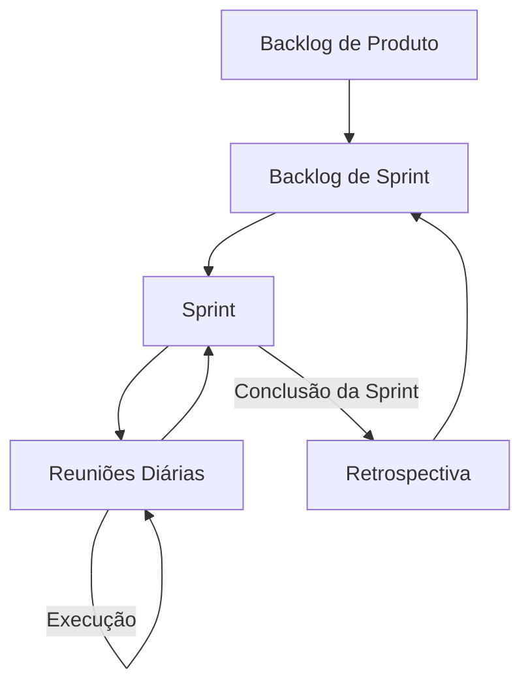

# Sprint de Projeto-Integrado

Este documento contem as observações feitas durante a Sprint e a definição de equipe.

Ciclo basico de uma Sprint:

## Funções

`Iago - Scrum master, Product Owner, Time de Desenvolvimento`

## Sprint Backlog

```mermaid
gantt
    dateFormat D
    axisFormat %d
    Sprint Backlog : milestone, m1, 1, 0d
    Backlog 1 : 1d
    Backlog 2 : 1d
    Backlog 3 : 1d
    Final milestone : milestone, m2, 3, 1d
```

### Backlog 1 - Implementar o programa que gera a amostra.

Implementar um programa que gera a amostra assim como definido no README.md

### Backlog 2 - Implementar o programa que faz a leitura dos resultados.

Implementar um programa que gera a que faz a leitura dos resultados assim como definido no README.md

### Backlog 3 - Implementar o programa que testa a performance dos algoritmos.

Implementar um programa que testa a performance dos algoritmos assim como definido no README.md

### Fim da Sprint, Retrospectiva

Fechar a sprint, verificar o que foi feito corretamente e o que foi feito de forma que não agradou.
Planejamento para a proxima sprint.

## Diario

### Backlog 1

Foi implementado o algoritmo que gera a amostra o mesmo está disponivel para operação no github.
 Não foi encontrado nenhum impedimento a esta tarefa.
